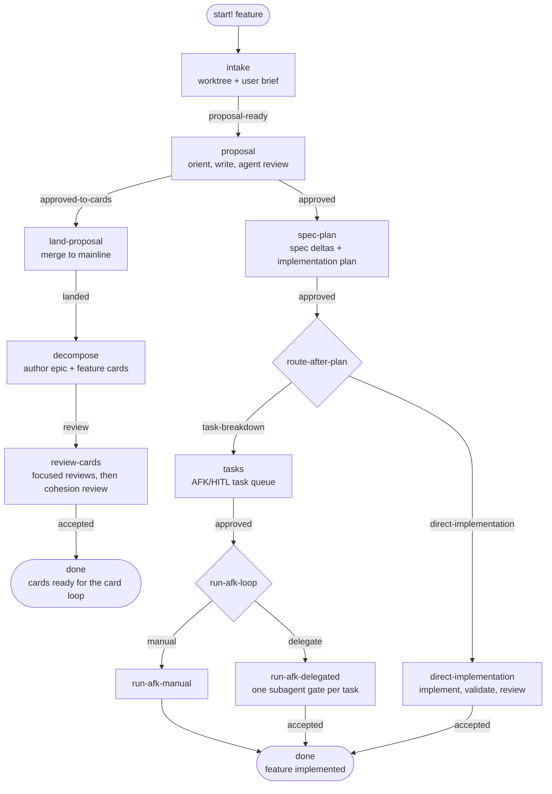
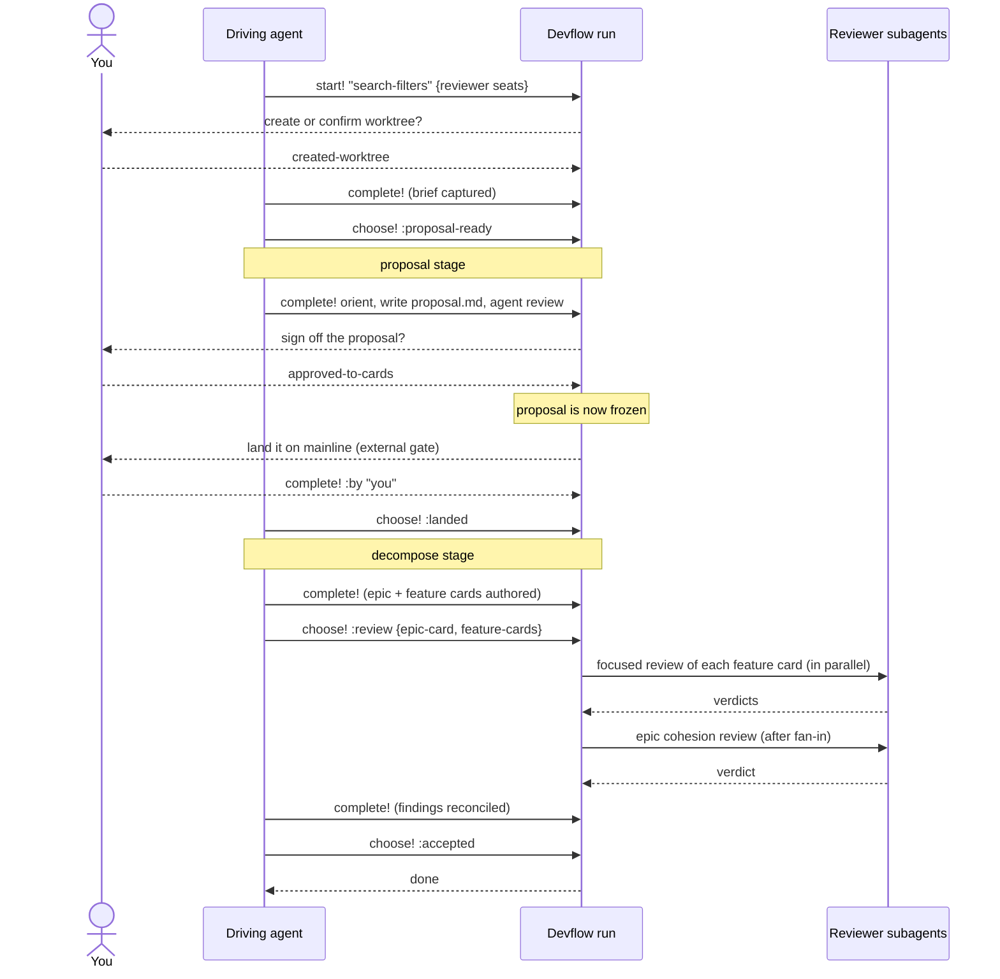
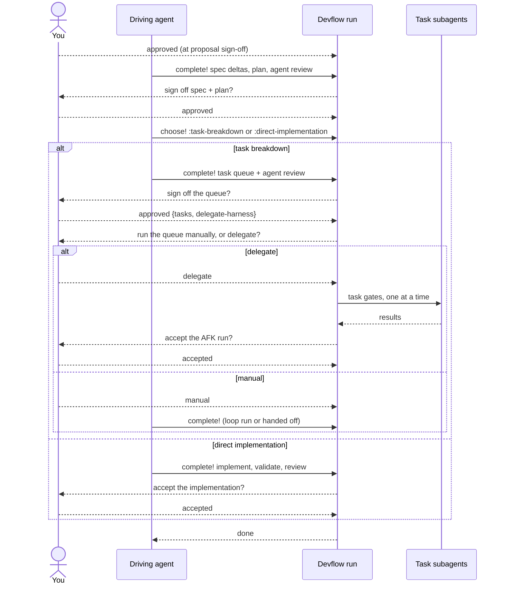
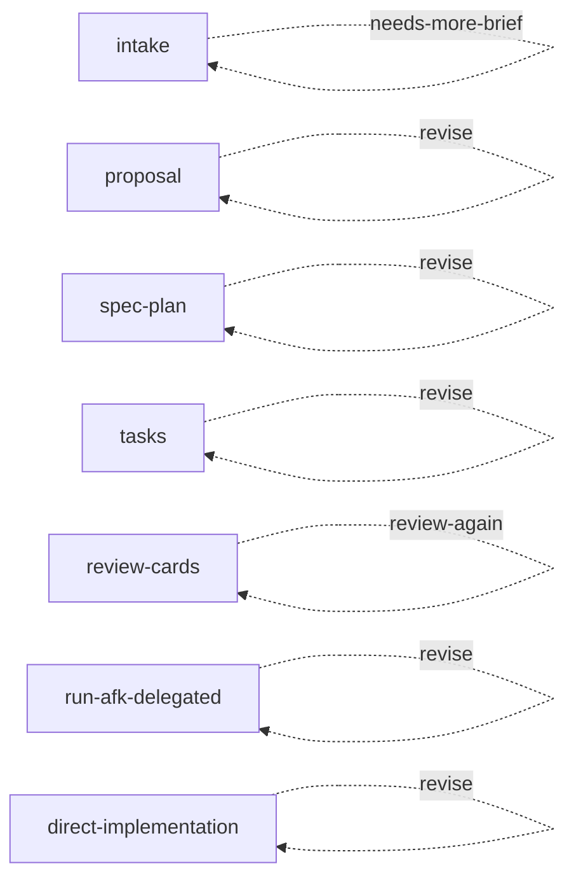

# Devflow

A feature-delivery lifecycle, built as
[Skein workflows](https://github.com/codethread/skein/blob/main/spools/workflow.md).
You name a feature; each stage hands you the next step or the next decision.

```sh
strand workflow start search-filters --workflow intake \
  --params '{"feature":"search-filters"}'
# => {"ready":[{"role":"checkpoint","checkpoint":"create-or-confirm-worktree",
#                "choices":["created-worktree","already-in-worktree","abort"]}],
#     "done":false}
```

**The feature name is the handle.** It *is* the `workflow/run-id`, so there is no
separate run handle to keep. Devflow owns static workflow definitions; Skein's
generic workflow API owns execution.

| You have | You call |
|---|---|
| A step to do | `strand workflow complete <feature>` |
| A decision to make | `strand workflow choose <feature> <choice> --input '<json>'` |
| Either, and you don't want to care which | `strand workflow next <feature> [--choice <choice>]` |

## What devflow leaves behind

> **Code tells you *what*. Devflow docs tell you *why*.**

The run is scaffolding. The output is a documentation trail that lives in the
repo alongside the code it explains.

```
devflow/
|-- README.md
|-- rfcs/YYYY-MM-DD-<slug>.md
|-- specs/<spec-name>.md              <- canonical: how the system behaves
|-- feat/<feature>/
|   |-- proposal.md                   <- why, agreed before any code
|   |-- specs/<spec-name>.delta.md    <- how this feature changes the above
|   |-- <feature>.plan.md
|   `-- tasks/index.yml + <id>-<slug>.md
`-- archive/yy-mm-dd__<feature>/      <- every past feature, proposals and deltas
```

**`proposal.md` — plan mode, written down.** It comes before any code, and the
stage stops for human sign-off. That gap is the point: time to consider the
framing and align with the agent while changing your mind is still cheap.
Approval freezes it, so it stays the record of what was actually agreed rather
than drifting into a summary of what got built.

**`specs/` + `<spec>.delta.md` — docs that travel with the code.**
`devflow/specs/` is canonical: it states the system's observable behaviours.
Every feature must say how it changes them, as a delta file beside its proposal —
so a proposed behaviour change is reviewable *as a diff against the current
contract*, not buried in prose. When the feature completes, its deltas merge into
the canonical specs. The docs can't fall behind the code, because updating them
is how a feature finishes.

**`archive/` — every feature that came before**, with its proposal, deltas, and
implemented RFCs intact. Historical context, explicitly not current truth: it
tells you why the current specs say what they say.

**Stable IDs, everywhere.** Every document and every point inside it carries a
grepable id — `PROP-Sfl-001`, `PLAN-Sfl-001.P1`, `SPEC-Sfl-002@3`. Prefixes are
`RFC`, `PROP`, `SPEC`, `DELTA`, `PLAN`, `TASK`; nested ids are prefixed with
their document's full id, so they never clash. You can point an agent at
`PLAN-Sfl-001.P3` in chat and it lands on exactly one paragraph — and the same
search still finds it in the archive years later.

The rules for writing each of these ship as data — see
[authoring guidance](#authoring-guidance).

## The lifecycle



Each stage is its own workflow definition. Choosing a routed option closes the
current stage and opens the next one under the same feature name, so a run is a
chain of small, inspectable stages rather than one giant graph.

| Stage | What happens | Who decides the exit |
|---|---|---|
| `intake` | Confirm you're in a feature worktree, capture the user's brief, agree the scope is clear enough to propose | you, then the agent |
| `proposal` | Read the surrounding RFCs/specs/code, write `proposal.md`, run an agent review | **you** |
| `land-proposal` | Wait for the approved proposal to be merged to mainline, then confirm it landed | whoever merges, then the agent |
| `decompose` | Author one epic card and self-contained feature cards from the merged proposal | the agent |
| `review-cards` | Review every feature card in parallel, then the epic as a whole, then reconcile findings | the agent |
| `spec-plan` | Write spec deltas and the implementation plan, run an agent review | **you** |
| `route-after-plan` | Decide: task queue, or implement directly | the agent |
| `tasks` | Write the AFK/HITL task queue, run an agent review | **you** |
| `run-afk-loop` | Decide: run the queue yourself, or delegate it to subagents | **you** |
| `run-afk-manual` | Run or hand off the AFK loop in this worker | — (closes the run) |
| `run-afk-delegated` | One sequential subagent per approved task, then accept the result | **you** |
| `direct-implementation` | Implement, validate, review, accept | **you** |
| `abort` | Record why the feature stopped | — (closes the run) |

## Which route should I take?

Proposal sign-off is the fork. **Prefer `approved-to-cards`.**

**`approved-to-cards` — the cards route.** Devflow's job ends at *"the approved
proposal is merged on mainline and the implementation cards are authored and
reviewed."* Implementation then belongs to your card loop, where each card is
worked cold by its own agent. This is the right shape when the work is bigger
than one session's context.

**`approved` — the single-run route.** Spec deltas, plan, task queue, and
implementation all happen inside this one run. Take this when the feature
genuinely wants its implementation driven here — small, settled, one sitting.

Both routes are fully supported. Reach for the single-run route deliberately;
otherwise take the cards route.

### The cards route, end to end



Two things to know about the reviews:

- **Focused reviews judge one card each** — its cold-work contract: evidence of
  current state, target outcome, constraints, proposal traceability, done-when,
  validation gates, and whether it can land independently.
- **The epic review judges only the connections** — coverage, gaps and overlaps,
  slicing, dependency edges, integration seams. It starts only after every
  focused review closes, and deliberately does not repeat their work.

If reconciling findings changed a card materially, choose `:review-again` with
the *current* full card set and the next round fans out over that.

The cards route needs two reviewer seats, supplied as start params so your
workspace config picks the harnesses:

```sh
strand workflow start search-filters --workflow intake --params \
  '{"feature":"search-filters","feature-card-reviewer":"pi-low-ro",\
    "epic-card-reviewer":"opus-strong-ro","review-cwd":"/path/to/worktree"}'

;; ... approve to cards, land the proposal, author the cards ...

strand workflow choose search-filters review --input \
  '{"epic-card":{"id":"epic-42","title":"Search filters"},\
    "feature-cards":[{"id":"card-43","title":"Filter query contract"},\
                     {"id":"card-44","title":"Filter result UI"}]}'
;; => {:ready [{:gate "subagent" :title "Focused review of feature card card-43: ..."}
;;             {:gate "subagent" :title "Focused review of feature card card-44: ..."}]
;;     :done false}
```

Both seats are validated at `:approved-to-cards`, *before* the merge gate opens —
missing review policy can't surface only after you've merged something. Card ids
must be distinct and token-safe (`[A-Za-z0-9][A-Za-z0-9._-]*`) because they
become step ids, and the epic id must differ from every feature id.

### The single-run route



Delegating the queue is opt-in. Pass the tasks when you approve it, then choose
`:delegate`:

```sh
strand workflow choose search-filters approved --input \
  '{"tasks":[{"id":"impl","title":"Implement filters","body":"Use the signed-off plan."},\
              {"id":"tests","title":"Add regression tests"}],\
    "delegate-harness":"pi-main","delegate-cwd":"/path/to/feature/worktree"}'
;; => {:ready [{:gate "subagent" :title "Delegate AFK task impl for search-filters" ...}]
;;     :done false}
```

Task maps may be keyword- or string-keyed (choice input often round-trips
through JSON). Ids must be token-safe and distinct — they become step ids. Every
task must resolve a harness, either its own `:harness` or the stage's
`:delegate-harness`. An optional `:delegate-preamble` is prepended to each task
prompt verbatim; devflow adds no policy of its own.

Choosing `:manual` needs no task data at all — it's a single step for running or
handing off the loop yourself.

## Revising

Every human sign-off offers `:revise`, intake's scope discussion offers
`:needs-more-brief`, and card review offers `:review-again`. All of them re-run
the stage under the same feature name, carrying your original start params
forward.



Two stages skip work they've already done, so a revision round starts where it
matters:

- **intake** skips the worktree checkpoint — the worktree already exists, so the
  round is ready at "capture brief".
- **proposal** skips orientation — you already read the surrounding context, so
  the round is ready at "write proposal".

The other stages re-run in full. `:review-again` requires the current epic and
feature-card refs, so a reconciliation that added or removed cards replaces the
next round's fan-out.

**Revision is stage-local.** Approving after a revise never leaks "this is a
revision" into the next stage.

### The proposal freezes at approval

Revision rounds are the proposal document's **only** editing window. `:approved`
and `:approved-to-cards` both mark it Approved and stop the edits: no later stage
reopens it.

Implementation is free to diverge from it — the spec deltas, the plan, and the
code carry what is true *now*, and the plan records why scope moved. Keeping an
approved proposal in sync with the build would hide the intent everyone actually
agreed to behind a document that merely looks current, and cost a round of
busywork per change to do it.

## Aborting

Every human decision point can abort, plus the three agent checkpoints where a
feature can genuinely become undeliverable: `:confirm-proposal-landed` (the
proposal won't land), `:handoff-card-review` (no reviewable card set could be
authored), and `:card-review-verdict` (the decomposition can't be made
reviewable). Intake's scope discussion and the post-plan route choice have no
abort — neither is a place where stopping is the answer.

Abort always requires a reason, and `choose!` fails before mutating anything if
you omit it:

```clojure
strand workflow choose search-filters abort --input \
  '{"reason":"Superseded by the unified query work"}'
```

The reason is recorded on the abort step, which then closes the run.

## Authoring guidance

Devflow doesn't just tell you to write a proposal — it ships the rules for
writing one, as data. Any step that authors a document advertises its guide key
in the `devflow/guide` strand attribute.

```clojure
(devflow/guidance)           ; workspace overview: layout, paths, invariants, ID scheme
(devflow/guidance :proposal) ; one artifact's full authoring guide
```

Every guide has the same shape: `:purpose`, `:artifacts`, `:prerequisites`,
`:knowledge`, `:procedures`, `:constraints`, `:validation`, `:templates`,
`:see-also`.

| Guide | For |
|---|---|
| `:proposal` | Feature-local problem framing; frozen at sign-off as the agreed intent |
| `:rfc` | Pre-feature decision record: options, tradeoffs, recommendation, outcome |
| `:spec` | Stable system boundaries — root specs, feature specs, and deltas |
| `:plan` | The reviewable build strategy between framing and task slicing |
| `:tasks` | A deterministic AFK queue of tracer-bullet vertical slices |
| `:afk` | Running that queue unattended until it's exhausted, blocked, or failing |
| `:decompose` | Turning a merged proposal into cards a cold agent can work |
| `:finish-archive` | Closing out a shipped or abandoned feature |

`:rfc` and `:finish-archive` have no stage step of their own. RFCs get written on
demand when intake or proposal work exposes real uncertainty; finish/archive is
the workspace-side procedure you follow after `squash-run!`.

`(devflow/guidance)` also returns the workspace invariants and the ID convention:
which document owns what, which are writable when, and how to allocate the next
id without clashing with the archive.

## Finishing a run

From trusted Clojure (the generic worker CLI deliberately has no squash verb):

```clojure
(require '[skein.spools.workflow :as workflow])

(workflow/squash-run! "search-filters")
```

Squashes a finished run into one closed digest strand. It fails loudly while any
stage is still active. This closes out the *graph* only — spec promotion, plan
status, and moving the feature folder into `devflow/archive/` are the workspace
side, described by `(devflow/guidance :finish-archive)`.

---

## Reference

### Commands

Devflow adds no runtime façade. Use Skein's generic workflow surface:

| Need | Command |
|---|---|
| Discover definitions | `strand workflow list`, then `strand workflow show intake` |
| Start the lifecycle | `strand workflow start <feature> --workflow intake --params '<json>'` |
| Inspect a feature | `strand workflow ready <feature>` or `strand workflow choices <feature>` |
| Advance it | `strand workflow complete`, `choose`, or `next` |
| Read history / archive | trusted Clojure: `workflow/run-history`, `workflow/squash-run!` |

The generic workflow functions own the equivalent Clojure API. Devflow's one
static helper is `(devflow/guidance)`.

### Resume discovery

Devflow publishes two named queries with the module:

| Query | Command | Result |
|---|---|---|
| `devflow-runs` | `strand list --query devflow-runs` | Active lifecycle roots that can be resumed. |
| `devflow-ready` | `strand ready --query devflow-ready` | Ready work beneath active Devflow roots. |

The ready query follows `parent-of` edges from a Devflow root, because
`workflow/family` belongs to the root rather than each step.

### Start parameters

Supplied to `strand workflow start … --params` and carried in context for the
whole run, surviving every revision loop.

| Param | Default | Meaning |
|---|---|---|
| `:worktree-check` | `"required"` | `"already-in-worktree-ok"` when the agent is already running inside the feature worktree |
| `:feature-card-reviewer` | — | Harness alias for focused card reviews (required by the cards route) |
| `:epic-card-reviewer` | — | Harness alias for the epic cohesion review (required by the cards route) |
| `:review-cwd` | — | Working directory for review subagents |

Each stage declares a `:param-spec` over the whole map, and every checkpoint
choice that takes input declares its own contract — so generic `workflow choose`
rejects a bad input map before it routes.

### Stage definitions

Devflow registers fourteen named workflow definitions: `intake`, `proposal`,
`land-proposal`, `decompose`, `review-cards`, `spec-plan`, `route-after-plan`,
`tasks`, `run-afk-loop`, `run-afk-manual`, `run-afk-delegated`,
`direct-implementation`, `agent-review`, and `abort`.

`intake` is the sole `:start` definition. `agent-review` is a reusable call-only
procedure; the remaining stages are continuations that can also be called.
Inspect them through the live generic registry:

```sh
strand workflow list
strand workflow list --entrypoint continue
strand workflow show review-cards
```

### Strand attributes

What devflow writes on the graph, if you're building tooling over it.

| Attribute | Meaning |
|---|---|
| `workflow/family` | `"devflow"` on every devflow stage root |
| `devflow/stage` | `"intake"`, `"proposal"`, `"land-proposal"`, `"decompose"`, `"card-review"`, `"spec-plan"`, `"route-after-plan"`, `"tasks"`, `"afk"`, `"implementation"`, `"abort"` |
| `devflow/feature` | The feature name; the roster spool reads its presence to report `roster/engine "devflow"` |
| `devflow/guide` | The authoring guide key for this step |
| `devflow/task` | The approved AFK task id a delegated gate is running |
| `devflow/review` | `"agent"` on agent review work |
| `devflow/review-scope` | `"feature-card"` or `"epic"` on card-review gates |
| `devflow/card` | The card id a review gate judges |
| `devflow/worktree-check` | On the intake root, from `:worktree-check` |
| `workflow/artifact` | What a step produces: `"brief"`, `"proposal.md"`, `"specs/*.delta.md"`, `"<feature>.plan.md"`, `"tasks/index.yml"` |
| `workflow/decision-point` | What a checkpoint decides, e.g. `"proposal-signed-off"` |
| `workflow/action-ref` | The action/skill an agent should invoke, e.g. `"devflow.proposal.orient"` |
| `workflow/gate` | `"subagent"` on delegated AFK and card-review gates; `"human"` on the proposal merge gate |
| `workflow/instruction` | Freeform guidance surfaced in the step view |
| `agent-run/harness`, `agent-run/prompt`, `agent-run/cwd` | What a delegated run gets |

Every Devflow root carries a known `devflow/stage`; use the root attributes when
building a projection that needs the current stage. The generic step view remains
engine-owned.

The proposal merge gate is repo-agnostic: any mainline merge process counts, and
generic `workflow complete` records who landed it via `--by`.

`(devflow/dependency-sentinel)` returns `"devflow-spool"` through this spool's
declared Maven dependency, so runtime validation can observe that approved spool
dependencies resolved.

### See also

- [README.md](./README.md) — installation, source approval, and activation.
- [Skein workflow.md](https://github.com/codethread/skein/blob/main/spools/workflow.md)
  — the engine underneath: run lifecycle, checkpoints and routing, gates,
  molecule ops, and the full `workflow/*` vocabulary.
- `(skein.spools.workflow/explain topic)` — machine-readable builder contracts.
- [Skein's writing-shared-spools guide](https://github.com/codethread/skein/blob/main/docs/spools/writing-shared-spools.md#publishing-a-shared-spool-with-git-distribution)
  — how git-distributed spools like this one are published and pinned.
